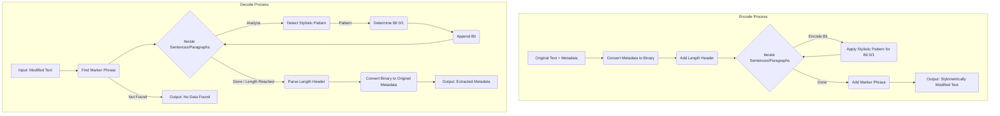

```mermaid
graph TD
    subgraph Encode Process
        A[Original Text + Metadata] --> B(Convert Metadata to Binary);
        B --> C(Encode Binary as ZWSP/ZWNJ);
        C --> D(Add ZWJ Markers + Length Header);
        D --> E(Inject ZW Payload into Text);
        E --> F(Sign Modified Text);
        F --> G[Output: Signed Text with Hidden Data];
    end

    subgraph Decode Process
        H[Input: Signed Text] --> I(Verify Signature);
        I -- Valid --> J(Find ZWJ Markers);
        J --> K(Extract ZW Payload);
        K --> L(Decode ZWSP/ZWNJ to Binary);
        L --> M(Parse Length Header);
        M --> N(Convert Binary to Original Metadata);
        N --> O[Output: Extracted Metadata + Signer ID];
        I -- Invalid --> P[Output: Verification Failed];
    end
```

# Diving Deep into Stylometrics: A Tour of Our GenAIScript Modules 🌊

Welcome back to the Stylometrics project blog! In our previous technical notes, we laid out the blueprints. Today, we're taking a more scenic route, exploring the individual GenAIScript modules that form the heart of our multi-layered steganographic and detection system. Think of this as a guided tour through our digital workshop, showcasing the tools we've built.

Our goal? To embed information within text so subtly that it blends in naturally, or conversely, to detect the faint digital fingerprints left by AI generation. Let's dive into the scripts that make this possible!

---

## 1. Script: `safety_embedded_word.genai.mts` - The Invisible Ink 🖋️

**Purpose:** This is our foundational steganography layer. It hides data within text using zero-width Unicode characters, making the embedded information completely invisible to the human eye. It also integrates cryptographic signing to verify the content's origin and integrity.

**How it Works:**
It converts the data to hide into a binary string. Each '0' bit is represented by a Zero-Width Space (ZWSP, `\u200B`), and each '1' bit by a Zero-Width Non-Joiner (ZWNJ, `\u200C`). Special markers (using Zero-Width Joiner, ZWJ, `\u200D`) and a length header are added to ensure reliable extraction. The entire payload is then injected into the text. Finally, the modified text is cryptographically signed.

**Process Flow:**



**Example Usage:**

```javascript
// Conceptual call to encode
const result = await runPrompt("safety_embedded_word", {
  vars: {
    operation: "encode", // Hypothetical parameter
    originalContent: "This is the text to hide data in.",
    metadata: JSON.stringify({ id: "doc123", author: "alice" }),
    signerName: "alice",
    // Assume keyManager is implicitly available or configured
  }
});
// result.text would contain the encoded content
// result.signature would contain the signature

// Conceptual call to decode
const decoded = await runPrompt("safety_embedded_word", {
  vars: {
    operation: "decode", // Hypothetical parameter
    encodedContent: result.text,
    signature: result.signature,
    // Assume keyManager is implicitly available
  }
});
// decoded.text might contain the extracted JSON metadata string
// decoded.signerName would contain 'alice' if valid
```

Notes: High capacity, completely invisible, but fragile – easily removed by text processors that strip unknown Unicode characters.

---

## 2. Script: `safety_stylometric_encoder.genai.mts` - The Linguistic Chameleon 🦎

**Purpose:** This script takes a different approach, embedding data by subtly altering the style of the text itself. It manipulates sentence structure, punctuation, and word choices in ways designed to mimic natural writing variations.

**How it Works:** Similar to the zero-width encoder, data is converted to binary. However, instead of invisible characters, bits are encoded by choosing between stylistic alternatives. For example, a '0' might be encoded by ensuring a sentence uses simple structure and ends with a period, while a '1' might involve using a more complex sentence structure, adding an adverb, or ending with a question mark or exclamation point. A marker phrase helps locate the encoded section.

**Process Flow:**



**Example Usage:**

```javascript
// Conceptual call to encode
const encodedText = await runPrompt("safety_stylometric_encoder", {
  vars: {
    text: "A paragraph of text. It needs to be long enough. Sentences provide encoding opportunities.",
    dataToEncode: JSON.stringify({ version: "1.1", status: "draft" })
  }
});
// encodedText.text would contain the modified text

// Conceptual call to decode
const extractedData = await runPrompt("safety_stylometric_encoder", {
  vars: {
    text: encodedText.text // Use the output from encoding
  }
});
// extractedData.text might contain the JSON metadata string
```

Notes: More robust against simple character stripping than zero-width. Lower capacity. Changes might be subtly perceptible, but aim for plausible deniability.

3. Script: safety_structural_encoder.genai.mts - The Architectural Blueprint 🏛️
Purpose: This is the most robust encoding layer, designed to survive significant transformations like paraphrasing or even translation. It embeds data in high-level structural and narrative patterns of the text.

How it Works: This method operates on larger text units (paragraphs, sections). It analyzes features like point-of-view (1st/3rd person), tense, rhetorical devices (questions vs. statements at ends of paragraphs), and even paragraph length patterns. Bits are encoded by subtly shifting these large-scale structures. For example, a '0' might favor first-person narration or alternating short/long paragraphs, while a '1' might favor third-person or consistent paragraph lengths.

Process Flow:

