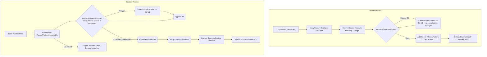
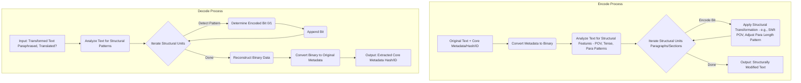
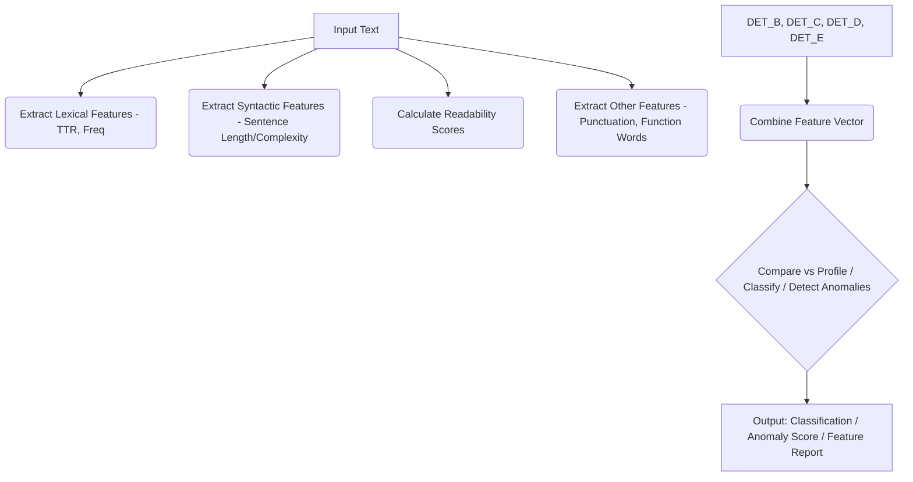

# Diving Deep into Stylometrics: A Tour of Our GenAIScript Modules for Robust Content Protection 🌊

Welcome back to the Stylometrics project blog! Building on our previous discussions about moving #BeyondWatermarks, today we're exploring the specific GenAIScript modules that power our multi-layered system. This isn't just about hiding data; it's about embedding **verifiable, persistent, and cryptographically secure fingerprints** within your content.

Our goal is ambitious: to enable robust **Digital Rights Management (DRM), Data Loss Prevention (DLP), and provenance tracking** that survives aggressive content transformations. This allows creators and enterprises to distribute content more confidently, even into higher-risk environments, secure in the knowledge that they can **assert ownership, track usage, identify leaks, and combat unauthorized commercialization (like illicit merchandise using embedded serial numbers)**, ultimately protecting revenue and managing risk.

Let's examine the tools in our workshop, exploring their mechanisms, features, and diverse applications.

---

## 1. Script: safety_embedded_word.genai.mts - The Invisible Foundation 🖋️

**Purpose:** Implements the **primary, high-capacity steganographic layer** using zero-width Unicode characters. Embeds arbitrary metadata (creator IDs, timestamps, licensing terms, content hashes, distribution channel markers) invisibly within text.

**Cryptographic Fingerprinting:** Integrates **cryptographic signing** (e.g., ECDSA) of the embedded metadata and/or the content hash. This creates a **verifiable, non-repudiable proof of origin and integrity**. Anyone with the public key can confirm the content hasn't been tampered with and originated from the claimed source.

**How it Works:** Metadata is converted to binary. Zero-Width Space (ZWSP, `\u200B`) represents '0', Zero-Width Non-Joiner (ZWNJ, `\u200C`) represents '1'. Special markers (Zero-Width Joiner, ZWJ, `\u200D`) and a length header frame the payload, which is injected between characters in the text. The metadata payload (or a hash of the content + metadata) is then cryptographically signed using a private key associated with the `signerName`.

**Special Features:**
*   **Highest Capacity:** Ideal for embedding detailed license terms, multiple identifiers, or even small encrypted payloads.
*   **Complete Invisibility:** Undetectable by human readers in standard text displays.
*   **Verifiable Authenticity:** Cryptographic signature provides strong proof of origin and integrity against tampering.

**Erasure Coding:** While the zero-width characters themselves are fragile, the *metadata payload* can be erasure-coded *before* being converted to binary and embedded. This adds resilience, allowing recovery of the full metadata even if a portion of the zero-width sequence is accidentally deleted or corrupted (up to the code's tolerance).

**Use Cases & Applications:**
*   **DRM:** Embedding specific license terms (e.g., user count, expiry date) verifiable via signature.
*   **Attribution:** Proving authorship/ownership via signed creator IDs.
*   **Distribution Tracking:** Embedding unique channel IDs to trace leaks back to specific partners or distribution points.
*   **Integrity Check:** Verifying content hasn't been altered since signing.
*   **Basic DLP:** Identifying sensitive documents containing specific embedded markers if they appear outside authorized channels (assuming the marker survives).

**Process Flow:**



```mermaid
graph TD
    subgraph Encode Process
        A[Original Text + Metadata Creator, Rights, Hash, ChannelID, etc.] --> B(Apply Erasure Coding to Metadata);
        B --> C(Convert Coded Metadata to Binary);
        C --> D(Encode Binary as ZWSP/ZWNJ);
        D --> E(Add ZWJ Markers + Length Header);
        E --> F(Inject ZW Payload into Text);
        F --> G(Sign Metadata/Hash w/ Private Key);
        G --> H[Output: Text with Signed, Verifiable Hidden Data];
    end

    subgraph Decode Process
        I[Input: Text] --> K(Find ZWJ Markers);
        K --> L(Extract ZW Payload);
        L --> M(Decode ZWSP/ZWNJ to Binary);
        M --> N(Parse Length Header);
        N --> O(Apply Erasure Correction);
        O --> P(Convert Binary to Original Metadata);
        P --> S(Retrieve Signature - often stored separately or via convention);
        S --> T(Verify Signature of Metadata/Hash w/ Public Key);
        T -- Valid --> Q[Output: Extracted Metadata + Verified Signer ID];
        T -- Invalid --> R[Output: Verification Failed / Tampered];
    end
```

**Example Usage (Distribution Tracking):**

```javascript
// Define the text that might leak
const leakedText = "Some text containing the leaked preview content with embedded zero-width characters.";

// Encode content for Partner B with a unique channel ID
// Assumes 'runPrompt' is available and configured (see genaiscript.d.ts)
// Assumes 'publisher_corp' key is managed by the KeyManager used by the script
const result = await runPrompt("safety_embedded_word", {
  vars: {
    operation: "encode",
    originalContent: "Exclusive preview content.",
    metadata: JSON.stringify({ contentId: "PREV002", channel: "PartnerB", hash: "sha256-abc..." }),
    signerName: "publisher_corp", // Identifier for the signing key
  }
});

// Check if encoding was successful (result might contain error info otherwise)
if (result && result.text) {
    console.log("Encoded Text:", result.text);
    // Distribute result.text to Partner B
} else {
    console.error("Encoding failed:", result?.error);
}


// If content leaks, analyze the leaked text
// Assumes 'leakedText' contains the content found in the wild
const decoded = await runPrompt("safety_embedded_word", {
  vars: {
    operation: "decode",
    encodedContent: leakedText,
    // Signature verification requires the public key associated with 'publisher_corp'.
    // The script likely retrieves this based on convention or embedded hints.
  }
});

// Check decoding results
if (decoded && decoded.text) {
    try {
        const metadata = JSON.parse(decoded.text);
        console.log("Decoded Metadata:", metadata);
        // If successful and signature verifies (implicit in successful decode):
        // metadata.channel reveals "PartnerB", identifying the source of the leak.
        if (metadata.channel === "PartnerB") {
            console.log("Leak traced back to PartnerB.");
        }
    } catch (e) {
        console.error("Failed to parse decoded metadata:", e);
        console.log("Raw decoded text:", decoded.text);
    }
} else {
    console.error("Decoding failed or no data found:", decoded?.error);
}
```

**Notes:** High capacity, invisible, but fragile to text sanitization. The cryptographic signature is paramount for its role in **verifiable DRM and attribution**. Erasure coding adds robustness to the payload itself.

---

## 2. Script: safety_stylometric_encoder.genai.mts - The Linguistic Chameleon 🦎

**Purpose:** Implements the secondary steganographic layer, focusing on resilience against intermediate content processing (reformatting, copy-pasting) and evading statistical detection. Embeds data by subtly altering linguistic style (sentence structure, punctuation, word choice), preserving attribution information when invisible characters are stripped.

#### Cryptographic Fingerprinting: 
The payload embedded (typically erasure-coded) represents cryptographic metadata (hashes, IDs, license snippets). The stylistic changes themselves are the carrier. While the entire modified text could be signed externally, the core verification relies on successfully extracting the embedded (potentially signed or hashed) metadata.

#### How it Works: 
Erasure-coded metadata is converted to binary. Bits dictate choices between pre-defined stylistic alternatives applied to sentences or phrases (e.g., using an Oxford comma vs. not, choosing a specific synonym like 'utilize' vs 'use', slightly altering sentence complexity). The algorithm attempts to make changes that fit the surrounding text's style. A marker phrase or pattern (potentially subtle or statistical itself) helps locate the encoded section during decoding.

### Special Features:

**Resilience to Sanitization:** Survives copy-paste, format changes, and basic text editing better than zero-width characters.
Statistical Deniability: Changes aim to mimic natural writing variations, making detection based purely on character statistics harder. Requires careful tuning to avoid introducing detectable anomalies.
Style Adaptation: Attempts to blend embedded data markers with the original author's style, reducing perceptual impact. This is challenging and may require sophisticated analysis or models.
Erasure Coding: Essential for this layer. The metadata payload is erasure-coded before being translated into stylistic changes. This allows recovery even if some stylistic patterns are altered, lost during editing, or misinterpreted during extraction, provided enough redundant patterns survive.

### Use Cases & Applications:

**Persistent Attribution:** Maintaining author/owner IDs through document format conversions (e.g., DOCX -> TXT -> HTML).
**DLP:** Embedding sensitivity labels (e.g., "Internal Use Only") that might survive basic email filtering or document cleaning.
**License Snippet Persistence:** Ensuring core license identifiers (like a CC license type or a product key prefix) remain embedded even after reformatting.
**Forensic Watermarking:** Embedding unique identifiers per recipient in slightly different stylistic ways to trace leaks (requires careful management of variations).

**Process Flow:**



**Example Usage (Persistent License ID):**

```javascript
// Encode software documentation with a license ID
const encodedText = await runPrompt("safety_stylometric_encoder", {
  vars: {
    text: "User manual for Product X. Refer to license agreement for details.",
    // Embed license type and version
    dataToEncode: JSON.stringify({ license: "EULA-v2.1", hash: "sha256-def..." })
  }
});
// encodedText.text is included in the software package

// User copies a section into a forum post
const forumPostText = "Copied section: ... " + encodedText.text.substring(50, 250) + " ...";

// Attempt extraction from the forum post
const extractedData = await runPrompt("safety_stylometric_encoder", {
  vars: {
    text: forumPostText
  }
});
// If enough patterns survived the copy/paste and potential forum reformatting:
// extractedData.text might reveal { license: "EULA-v2.1", ... }, confirming the software version.
```

**Notes:** Balances resilience and capacity. Key for maintaining **attribution persistence** through moderate transformations and supporting **DLP scenarios**. Erasure coding is critical for robustness.

---

## 3. Script: [`safety_structural_encoder.genai.mts`](/home/files/git/Stylometrics/safety_structural_encoder.genai.mts ) - The Architectural Blueprint 🏛️

**Purpose:** Implements the **most resilient steganographic layer**, designed for **maximum metadata persistence** against aggressive transformations like heavy paraphrasing, summarization, or even translation. Embeds critical, compact data (like content hashes, original source IDs, or core rights assertions) within high-level structural, narrative, and rhetorical patterns.

**Cryptographic Fingerprinting:** The small payload embedded typically consists of or includes cryptographic hashes or unique identifiers derived from the original content or its signature. This allows linking the transformed content back to its verifiable origin, even if the original signature and other layers are lost. It acts as a persistent **cryptographic anchor**.

**How it Works:** Operates on large text units (paragraphs, sections). Analyzes high-level features (Point-of-View, tense, rhetorical devices like question/statement patterns, dialectic structure, paragraph length/alternation patterns). Encodes bits by subtly shifting these large-scale structures according to predefined, robust rules (e.g., favoring 1st person for '0', 3rd person for '1' across sections). Extraction relies on recognizing these persistent structural choices even after significant rewording.

**Special Features:**
*   **Highest Resilience:** Designed to survive paraphrasing, summarization, AI rewriting, and potentially translation.
*   **Deep Structure Encoding:** Uses patterns less likely to be altered by surface-level edits.
*   **Last Line of Defense:** Provides a fallback for attribution when other layers are destroyed. Essential for long-term rights assertion.

**Erasure Coding:** Due to the extremely low capacity, applying erasure coding directly to the payload *within* this layer is often impractical. However, the *selection* of which structural elements to modify across the document can be distributed based on an erasure code scheme, adding resilience by ensuring the loss of a few modified sections doesn't prevent decoding. The embedded payload itself should be highly compact (e.g., a short hash or ID).

**Use Cases & Applications:**
*   **Asserting Ownership of Derivatives:** Proving a heavily summarized blog post originated from your signed research paper by extracting the embedded original hash.
*   **Tracking Content Across Platforms:** Identifying if content appearing on a pirate site, even if rewritten, originated from your distribution channel by extracting a channel ID.
*   **Combating Plagiarism/AI Misuse:** Linking AI-generated text back to source material if the AI inadvertently copied structurally embedded markers.
*   **Perpetual DRM Anchor:** Embedding a core, non-expiring identifier linked to the rights holder, surviving even format shifts and translations.
*   **Identifying Illicit Merchandise:** If product descriptions are copied and modified for counterfeit goods, extracting an embedded original product hash or identifier.

**Process Flow:**



**Example Usage (Identifying Unauthorized Merchandise):**

```javascript
// Encode original product description with a unique product hash
const structurallyEncoded = await runPrompt("safety_structural_encoder", {
  vars: {
    text: "Official description for Genuine Widget Model A. Long text detailing features...",
    dataToEncode: JSON.stringify({ product_hash: "a1b2c3d4e5f6" }) // Embed hash
  }
});
// Use structurallyEncoded.text on official website/packaging.

// Find a suspicious online listing with a rewritten description
const counterfeitListingText = "... amazing gadget, similar to Model A, great features...";
const recoveredData = await runPrompt("safety_structural_encoder", {
  vars: {
    text: counterfeitListingText
  }
});
// If structural patterns survived the rewrite:
// recoveredData.text contains "a1b2c3d4e5f6", linking the counterfeit listing back to the original product, supporting takedown requests.
```

**Notes:** Highest resilience, lowest capacity. Critical for **persistent DRM and proving provenance** across significant transformations. The embedded data acts as a cryptographic anchor.

---

## 4. Script: [`safety_encoder_demo.genai.mts`](/home/files/git/Stylometrics/safety_encoder_demo.genai.mts ) - The Dynamic Duo 🦸‍♀️🦸‍♂️

**Purpose:** Demonstrates combining the **zero-width** and **stylometric** layers for enhanced resilience and capacity. Provides a practical balance for many common distribution scenarios.

**Cryptographic Fingerprinting:** The final, doubly-encoded text is **cryptographically signed**, providing overall integrity verification. The metadata embedded in *both* layers (potentially erasure-coded and split) contains or references cryptographic hashes/IDs for robust attribution.

**How it Works:** Applies zero-width encoding first (high capacity), then applies stylometric encoding to that result (adds resilience). The final text is signed. Decoding prioritizes the more resilient stylometric layer, falling back to zero-width, and uses erasure coding to reconstruct the original metadata.

**Special Features:**
*   **Redundancy:** Increases chances of metadata survival. If zero-width is stripped, stylometric might remain.
*   **Balanced Approach:** Good compromise between capacity, invisibility, and resilience to moderate changes.
*   **Combined Verification:** Outer signature verifies the entire package; extracted metadata provides internal verification.

**Erasure Coding:** Metadata is typically erasure-coded *before* being split (or duplicated) and encoded into the two separate layers. This allows full recovery even if one layer is completely destroyed or partially damaged.

**Use Cases & Applications:**
*   **Standard Content Distribution:** Newsletters, reports, articles where moderate protection and verification are needed.
*   **Software Manuals/Documentation:** Embedding license keys or version info with resilience against copy/paste.
*   **Ebook Distribution:** Basic DRM and attribution that survives common reader format conversions.
*   **Internal Document Control:** Tracking document versions and authors within an organization.

**Process Flow:**



```mermaid
graph TD
    subgraph Encode Process Multilayer
        MA[Original Text + Metadata] --> MB(Apply Erasure Coding to Metadata);
        MB --> MC(Encode Part 1 via Zero-Width);
        MC --> MD(Encode Part 2 via Stylometric on ZW Result);
        MD --> ME(Sign Doubly-Encoded Text);
        ME --> MF[Output: Signed Text with Two Layers];
    end

    subgraph Decode Process Multilayer
        MG[Input: Signed Text] --> MH(Verify Outer Signature);
        MH -- Valid --> MI{Attempt Stylometric Extraction Part 2};
        MI -- Success --> MJ(Store Part 2); MI -- Failure --> MK(Mark Part 2 Missing); MJ --> MK;
        MK --> ML{Attempt Zero-Width Extraction Part 1};
        ML -- Success --> MM(Store Part 1); ML -- Failure --> MN(Mark Part 1 Missing); MM --> MN;
        MN --> MO(Combine Parts & Apply Erasure Correction);
        MO --> MP[Output: Extracted Metadata + Signer ID];
        MH -- Invalid --> MQ[Output: Verification Failed];
        MO -- Correction Fails --> MQ;
    end
```

**Example Usage (Ebook DRM):**

```javascript
// Encode ebook chapter with purchase ID and sign
const encodedPackage = await runPrompt("safety_encoder_demo", {
  vars: {
    operation: "encode",
    originalContent: "Chapter 1 of 'The Digital Maze'.",
    metadata: JSON.stringify({ purchaseId: "USER123-BOOK456", hash: "sha256-ghi..." }),
    signerName: "ebook_store",
  }
});
// Deliver encodedPackage.content to user

// Later, check attribution on a potentially reformatted copy
const decodedResult = await runPrompt("safety_encoder_demo", {
  vars: {
    operation: "decode",
    encodedContent: potentiallyReformattedContent,
    signature: encodedPackage.signature, // May be stored with user account
  }
});
// decodedResult.metadata confirms purchaseId, decodedResult.signerName confirms source
```

**Notes:** A practical blend leveraging **erasure coding** and **cryptographic signing** for robust **DRM and attribution** in common scenarios.

---

## 5. Script: [`safety_enhanced_integration.genai.mts`](/home/files/git/Stylometrics/safety_enhanced_integration.genai.mts ) - The Triple Threat 🛡️⚔️🧱

**Purpose:** The most advanced integration, combining **all three encoding layers** (zero-width, stylometric, structural) for **maximum resilience, verification options, and configurability**. Designed for high-value content or distribution into environments where aggressive modification is expected.

**Cryptographic Fingerprinting:** The final output is **cryptographically signed**. Metadata embedded across layers (distributed via erasure coding) includes cryptographic hashes/IDs. This enables **cross-layer integrity checks** (verifying data from different layers matches) and provides the most robust link back to the original signed source.

**How it Works:** Content flows sequentially: Zero-Width -> Stylometric -> Structural. Final result is signed. Decoding prioritizes by resilience: Structural -> Stylometric -> Zero-Width, applying erasure correction and integrity checks across recovered data segments.

**Special Features:**
*   **Maximum Resilience:** Leverages strengths of all three layers against diverse transformations.
*   **Highly Configurable:** Allows enabling/disabling layers, tuning parameters (e.g., structural strength), and choosing metadata distribution strategies.
*   **Cross-Layer Integrity Check:** Provides strong evidence against sophisticated tampering if extracted metadata from different layers doesn't match.
*   **Tiered Data Embedding:** Can embed different metadata in different layers (e.g., full license in ZW, core ID in structural).

**Erasure Coding:** Metadata is erasure-coded *before* being strategically distributed across the enabled layers. This provides the highest chance of recovery, as the original data can be reconstructed even if significant portions of multiple layers are damaged or destroyed.

**Use Cases & Applications:**
*   **High-Value Research/IP:** Protecting sensitive research papers or proprietary documents distributed to external partners.
*   **Financial Reports:** Ensuring integrity and tracking distribution of confidential financial data.
*   **Legal Documents:** Maintaining attribution and integrity of contracts or legal filings through multiple revisions or platform transfers.
*   **Government/Intelligence Documents:** Providing robust tracking and leak detection for classified or sensitive information.
*   **Content Syndication:** Allowing partners to modify content (within limits) while retaining verifiable source attribution and core rights information via the structural layer.

**Process Flow:**



```mermaid
graph TD
    subgraph Encode Process Enhanced
        EA[Original Text + Metadata + Options] --> EB(Apply Erasure Coding);
        EB --> EC(Encode Part 1 via Zero-Width?);
        EC --> ED(Encode Part 2 via Stylometric?);
        ED --> EE(Encode Part 3 via Structural?);
        EE --> EF(Sign Final Text);
        EF --> EG[Output: Signed Text with Up to Three Layers];
    end

    subgraph Decode Process Enhanced
        EH[Input: Signed Text] --> EI(Verify Outer Signature);
        EI -- Valid --> EJ{Attempt Structural Extraction Part 3};
        EJ -- Success --> EK(Store Part 3); EJ -- Failure --> EL(Mark Part 3 Missing); EK --> EL;
        EL --> EM{Attempt Stylometric Extraction Part 2};
        EM -- Success --> EN(Store Part 2); EM -- Failure --> EO(Mark Part 2 Missing); EN --> EO;
        EO --> EP{Attempt Zero-Width Extraction Part 1};
        EP -- Success --> EQ(Store Part 1); EP -- Failure --> ER(Mark Part 1 Missing); EQ --> ER;
        ER --> ES(Combine Parts & Apply Erasure Correction);
        ES -- Success --> ET(Check Cross-Layer Integrity?);
        ET --> EU[Output: Metadata + Signer ID + Integrity Status];
        EI -- Invalid --> EV[Output: Verification Failed];
        ES -- Correction Fails --> EV;
    end
```

**Example Usage (Content Syndication):**

```javascript
// Encode original article for syndication partner with usage rights
const enhancedPackage = await runPrompt("safety_enhanced_integration", {
  vars: {
    operation: "encode",
    originalContent: "Long-form article on renewable energy...",
    // Embed full rights in ZW/Stylometric, core ID in Structural
    metadata: JSON.stringify({ articleId: "RENEW001", rights: "syndicate-web-v1", hash: "sha256-jkl..." }),
    signerName: "news_agency",
    options: { useZeroWidth: true, useStylometric: true, useStructural: true, structuralStrength: 'moderate' },
  }
});
// Partner receives enhancedPackage.content

// Partner heavily edits and republishes the article
const republishedText = "... summary of renewable energy trends based on News Agency report ...";

// News Agency checks the republished article
const enhancedDecoded = await runPrompt("safety_enhanced_integration", {
  vars: {
    operation: "decode",
    encodedContent: republishedText,
    // Signature likely invalid due to edits, but internal data is the target
  }
});
// Even if ZW/Stylometric layers are gone, structural extraction might yield:
// enhancedDecoded.metadata contains { articleId: "RENEW001" }
// This confirms the origin despite heavy edits, allowing enforcement of syndication terms.
```

**Notes:** Highest resilience and verification capabilities. Ideal for high-value assets or scenarios requiring maximum protection against modification and sophisticated tampering.

---

## 6. Script: [`safety_visual_demo.genai.mts`](/home/files/git/Stylometrics/safety_visual_demo.genai.mts ) - DEMO 🖼️

**Purpose:** This script is purely **educational**, demonstrating the **invisibility** of the zero-width layer and the **cryptographic verification** process. It's designed to make the abstract concepts tangible.

**Cryptographic Fingerprinting:** Explicitly shows the signature verification step as part of the demonstration flow.

**How it Works:** Uses the `safety_encoder_demo` (ZW + Stylometric) for encoding/decoding. Its unique contribution is visualizing the normally invisible zero-width characters using visible placeholders (e.g., `⟨ZWSP⟩`). It prints comparisons and saves output files for inspection.

**Special Features:**
*   **Visual Explanation:** Makes zero-width encoding understandable.
*   **Verification Demo:** Clearly illustrates signature validation.
*   **Step-by-Step Output:** Shows original, encoded (looks same), visualized, and decoded states.

**Erasure Coding:** Inherits the erasure coding used by the underlying `safety_encoder_demo`.

**Use Cases & Applications:**
*   **Training:** Educating developers or stakeholders about steganographic principles.
*   **Debugging:** Providing a visual check of zero-width encoding output.
*   **Presentations:** Demonstrating the core concept of invisible watermarking.

**Process Flow:**


**Example Usage:**

```javascript
// Run the demo script from the command line or IDE task runner
// Example (conceptual command): genaiscript run safety_visual_demo

// --- Expected Output (Conceptual) ---
// [INFO] Running Visual Steganography Demo...
// [INFO] Generated Sample Text: "The quick brown fox jumps over the lazy dog."
// [INFO] Generated Metadata: { id: 'demo123', timestamp: 1713200000000 }
// [INFO] Using demo key pair (public key: 0xABC..., private key: ***)
//
// [OUTPUT] Original Text:
// The quick brown fox jumps over the lazy dog.
//
// [INFO] Encoding with safety_encoder_demo (ZW + Stylometric)...
// [INFO] Signing metadata + content hash with private key...
//
// [OUTPUT] Encoded Text (Visually Identical):
// The quick brown fox jumps over the lazy dog.
//
// [INFO] Visualizing Zero-Width Characters...
//
// [OUTPUT] Visualized Text:
// T⟨ZWJ⟩⟨ZWSP⟩⟨ZWNJ⟩...h⟨ZWSP⟩...e quick brown fox...
//
// [INFO] Decoding encoded text...
// [INFO] Verifying signature using public key...
//
// [RESULT] Signature Verification: VALID
// [RESULT] Decoded Metadata: { id: 'demo123', timestamp: 1713200000000 }
// [RESULT] Integrity Check: PASSED
//
// [INFO] Output files saved to demo-output/ directory.
// [INFO] Demo Complete.

// --- After running ---
// User checks the 'demo-output' directory for:
// - demo-output/original.txt
// - demo-output/encoded.txt (looks same as original)
// - demo-output/visualized.txt (shows placeholders)
// - demo-output/decoded.json (contains extracted metadata)
// - demo-output/signature.txt (contains the generated signature)
```

**Notes:** Excellent educational tool. Not intended for production encoding.

---

## 7. Script: [`stylometric_detection.genai.mts`](/home/files/git/Stylometrics/stylometric_detection.genai.mts ) - The Pattern Spotter 🕵️‍♀️

**Purpose:** Focuses on **analyzing** text to identify statistical stylometric patterns. This is crucial for establishing baselines (human vs. AI), detecting authorship changes, identifying potential stylistic manipulation (like steganography), or verifying content authenticity against known profiles.

**Cryptographic Fingerprinting:** While not directly involved in embedding, its analysis can help verify if the stylistic patterns expected from a specific *stylometric* or *structural* encoding are present, or if they have been disturbed, potentially indicating tampering even if cryptographic signatures are missing or invalid.

**How it Works:** Extracts a range of linguistic features (lexical, syntactic, readability, idiosyncratic) and compares them against known author profiles, AI model signatures, or expected patterns from specific encoding techniques. Can use statistical methods or machine learning models for classification.

**Special Features:**
*   **Comprehensive Feature Extraction:** Calculates diverse linguistic metrics.
*   **Baseline Creation & Comparison:** Profiles authors/AIs and detects deviations.
*   **Anomaly Detection:** Identifies unusual stylistic patterns potentially indicating manipulation or generation.
*   **Verification Support:** Can check if text conforms to expected stylistic fingerprints from specific encoders.

**Erasure Coding:** N/A (Analysis, not encoding).

**Use Cases & Applications:**
*   **AI Content Detection:** Identifying text likely generated by large language models.
*   **Authorship Attribution:** Determining the likely author of anonymous or disputed texts.
*   **Plagiarism Detection:** Identifying copied content even if slightly reworded, based on stylistic similarity.
*   **Forensic Linguistics:** Analyzing text for evidence in legal or investigative contexts.
*   **Steganalysis:** Detecting the *presence* of stylometric or structural steganography (though not necessarily decoding it).
*   **Quality Control:** Ensuring generated text adheres to specific brand style guidelines.

**Process Flow:**



**Example Usage (Verifying Stylometric Encoding Presence):**

```javascript
// Text suspected of containing stylometric encoding
const suspiciousText = "This text seems mostly normal, but uses semicolons; where commas might be expected, and perhaps utilizes slightly more complex words than necessary.";

// Analyze text suspected of containing stylometric encoding
const detectionResult = await runPrompt("stylometric_detection", {
  vars: {
    inputText: suspiciousText,
    // Optionally provide an expected profile or pattern type to check against
    // expectedProfile: "stylometric_encoder_v1_pattern_semicolon_synonym"
    // Or compare against a baseline of 'normal' text
    // baselineProfile: "standard_english_prose"
  }
});

// Check the result (structure depends on the specific implementation)
if (detectionResult && detectionResult.text) {
    try {
        const analysis = JSON.parse(detectionResult.text);
        console.log("Stylometric Analysis Result:", analysis);
        // Example expected output structure:
        // {
        //   "anomalyDetected": true,
        //   "confidence": 0.75,
        //   "matchingPatterns": ["unusual_punctuation_freq", "lexical_complexity_high"],
        //   "details": {
        //      "semicolon_freq": 0.05, // Higher than baseline
        //      "avg_word_length": 5.2 // Higher than baseline
        //   }
        // }
        if (analysis.anomalyDetected) {
            console.log(`Potential manipulation detected with confidence ${analysis.confidence}. Matching patterns: ${analysis.matchingPatterns.join(', ')}`);
        } else {
            console.log("Text appears stylometrically consistent with baseline/expectations.");
        }
    } catch (e) {
        console.error("Failed to parse analysis result:", e);
        console.log("Raw analysis output:", detectionResult.text);
    }
} else {
    console.error("Stylometric detection failed:", detectionResult?.error);
}
```

**Notes:** Essential analytical tool for understanding text style, detecting generation/manipulation, and supporting the verification of stylometric/structural encoding techniques.

---

## 8. Script: [`stylometric_carrier.genai.mts`](/home/files/git/Stylometrics/stylometric_carrier.genai.mts ) - The Feature Toolkit 🛠️

**Purpose:** Provides the **core, reusable logic** for using specific stylometric features (punctuation, word choice, sentence length, whitespace, etc.) as individual **data carriers**. It defines functions to analyze capacity, perform encoding modifications, and handle extraction for these techniques. Acts as a library or interface for higher-level encoders.

**Cryptographic Fingerprinting:** Manipulates text based on bits derived from (potentially erasure-coded) cryptographic metadata provided by a calling script. It enables the embedding of verifiable data but doesn't perform signing itself.

**How it Works:** Encapsulates analysis, encoding, and extraction logic for a specific feature. For example, a "punctuation carrier" analyzes text for modifiable punctuation, calculates capacity, accepts payload bits, modifies punctuation accordingly (e.g., comma to semicolon), and provides the reverse extraction function.

**Special Features:**
*   **Modular Design:** Isolates logic for each stylometric technique (e.g., quote style, whitespace, synonym substitution).
*   **Capacity Analysis:** Estimates data carrying potential for a specific feature in a text segment.
*   **Targeted Modification:** Performs the precise, low-level text changes.
*   **Reusability:** Provides building blocks for `safety_stylometric_encoder` and `stylometric_fusion`.

**Erasure Coding:** Operates on bits provided by the caller, which are typically derived from an erasure-coded payload.

**Use Cases & Applications:**
*   **Foundation for Stylometric Encoding:** Used internally by higher-level scripts.
*   **Research & Development:** Allows testing and comparing individual carrier techniques.
*   **Custom Encoders:** Enables building bespoke stylometric encoders by combining specific carriers.

**Process Flow (Conceptual for one carrier type):**


**Example Usage (Internal Call):**

```javascript
// Called internally by safety_stylometric_encoder or stylometric_fusion
const capacity = await runPrompt("stylometric_carrier", {
  vars: { operation: "analyze", inputTextSegment: "...", carrierType: "whitespace" }
});
const modifiedSegment = await runPrompt("stylometric_carrier", {
  vars: { operation: "encode", inputTextSegment: "...", payloadBits: "101", carrierType: "whitespace" }
});
const extractedBits = await runPrompt("stylometric_carrier", {
  vars: { operation: "extract", modifiedSegment: "...", carrierType: "whitespace" }
});
```

**Notes:** Foundational module providing the core mechanics for individual stylometric embedding techniques.

---

## 9. Script: [`stylometric_fusion.genai.mts`](/home/files/git/Stylometrics/stylometric_fusion.genai.mts ) - The Master Weaver 🧶

**Purpose:** Orchestrates the use of **multiple stylometric carriers simultaneously** within the same text. Aims to increase overall embedding capacity and/or resilience by distributing the payload across diverse linguistic features, managed by `stylometric_carrier`.

**Cryptographic Fingerprinting:** Embeds bits derived from erasure-coded cryptographic metadata across multiple carriers. The final fused text can be signed for overall integrity. Offers a more complex fingerprint spread across various stylistic elements.

**How it Works:** Analyzes text capacity across various supported carriers (punctuation, synonyms, etc.). Distributes erasure-coded payload bits among available carriers based on capacity, desired resilience, or configuration. Invokes `stylometric_carrier` for each selected feature modification. Extraction reverses this, querying each potential carrier and reassembling the payload using erasure correction.

**Special Features:**
*   **Multi-Carrier Encoding:** Combines different stylometric techniques (e.g., punctuation + whitespace + synonyms).
*   **Increased Capacity/Resilience:** Potentially higher payload or robustness than single stylometric methods by diversifying the embedding.
*   **Intelligent Distribution:** Can prioritize carriers based on text characteristics or desired outcome (e.g., prioritize less perceptible changes).

**Erasure Coding:** Essential. The metadata payload is erasure-coded before being intelligently split and distributed across the chosen set of stylometric carriers.

**Use Cases & Applications:**
*   **Higher Capacity Stylometric Embedding:** When more data needs to be embedded than a single technique allows, but structural changes are undesirable.
*   **Enhanced Stylometric Resilience:** Spreading data across multiple features makes it less likely that editing will destroy all traces.
*   **Adaptive Encoding:** Choosing the best mix of carriers based on the specific input text's characteristics.
*   **Layered Stylometric DRM:** Embedding different pieces of license information using different carriers within the same text.

**Process Flow:**



```mermaid
graph TD
    subgraph Encode Fusion
        FUS_A[Input Text + Metadata] --> FUS_AA(Apply Erasure Coding);
        FUS_AA --> FUS_B(Analyze Capacity for Multiple Carriers via stylometric_carrier);
        FUS_B --> FUS_C(Develop Bit Distribution Plan);
        FUS_C --> FUS_D{Iterate Payload Bits};
        FUS_D -- Assign Bit --> FUS_E(Select Carrier & Apply Modification via stylometric_carrier);
        FUS_E --> FUS_D;
        FUS_D -- Done --> FUS_F(Optionally Sign Final Text);
        FUS_F --> FUS_G[Output: Text with Multi-Carrier Encoding];
    end
    subgraph Extract Fusion
        FUS_H[Input Text] --> FUS_HA(Optionally Verify Outer Signature);
        FUS_HA --> FUS_I{Iterate Potential Carriers};
        FUS_I -- Extract from Carrier --> FUS_J(Get Bits via stylometric_carrier);
        FUS_J --> FUS_K(Store Extracted Bits);
        FUS_K --> FUS_I;
        FUS_I -- Done --> FUS_L(Reassemble & Apply Erasure Correction);
        FUS_L --> FUS_M[Output: Extracted Payload];
    end
```

**Example Usage (High-Capacity Stylometric Watermark):**

```javascript
// Encode text using multiple stylistic features
const fusedText = await runPrompt("stylometric_fusion", {
  vars: {
    inputText: "A lengthy report suitable for fusion encoding, using various sentence structures, punctuation options, and common words.",
    payload: JSON.stringify({ trackerId: "XYZ-789", version: 3, hash: "sha256-mno..." }),
    // Configure fusion strategy
    config: { carriers: ["punctuation", "whitespace", "synonym"], strategy: "maximize_capacity" }
  }
});
// fusedText.text contains subtle changes across multiple stylistic dimensions.

// Decode later
const extractedFusedData = await runPrompt("stylometric_fusion", {
  vars: { text: fusedText.text }
});
// extractedFusedData.text contains the trackerId/version if enough patterns survived.
```

**Notes:** Represents a sophisticated form of stylometric encoding, offering potentially higher capacity or resilience than single-method approaches by diversifying the embedding. Requires careful balancing to maintain naturalness.

---

## Comparison of Stylometrics Modules

This table summarizes the key characteristics of the encoding and analysis modules:

| Feature                       | `safety_embedded_word` (ZW) | `safety_stylometric_encoder` | `safety_structural_encoder` | `safety_encoder_demo` (ZW+Style) | `safety_enhanced_integration` (All 3) | `stylometric_fusion` (Multi-Style) | `stylometric_detection` (Analysis) | `safety_visual_demo` (Demo) | `stylometric_carrier` (Core) |
| :---------------------------- | :-------------------------: | :--------------------------: | :-------------------------: | :------------------------------: | :-----------------------------------: | :--------------------------------: | :--------------------------------: | :-------------------------: | :--------------------------: |
| **Primary Goal**              |        High Capacity        |    Sanitization Resilience   |  Transformation Resilience  |         Balanced Resilience        |          Maximum Resilience           |      High Stylometric Capacity     |         Style Analysis           |         Demonstration       |      Carrier Implementation      |
| **Payload Capacity**          |            High             |             Low              |          Very Low           |              Medium              |                 Medium                |                Medium                |                N/A                 |             N/A             |             Varies             |
| **Resilience (Sanitization)** |             Low             |            Medium            |            Medium           |              Medium              |                 Medium                |               Medium               |                N/A                 |             N/A             |             Varies             |
| **Resilience (Transform)**    |             Low             |             Low              |            High             |               Low                |                 High                  |                 Low                  |                N/A                 |             N/A             |             Varies             |
| **Invisibility (Visual)**     |            High             |            Medium            |             Low             |              Medium              |                 Medium                |               Medium               |                N/A                 |            High             |             Varies             |
| **Statistical Deniability**   |             Low             |             High             |            Medium           |               High               |                  High                 |                 High                 |                N/A                 |             N/A             |             Varies             |
| **Verification Strength**     |       High (Signature)      |      Med (Payload Verify)    |    High (Anchor Verify)     |        High (Sig + Payload)      |       Very High (Multi+Sig)       |         Med (Payload Verify)       |                Low                 |      High (Demo Verify)     |             N/A              |
| **Erasure Coding Use**        |       Payload Optional      |       Payload Essential      |      Payload Impractical     |        Payload Essential         |          Payload Essential          |         Payload Essential          |                N/A                 |          Inherited          |         Input Bits Only        |
| **Computational Cost**        |             Low             |            Medium            |            High             |              Medium              |               Very High               |                High                |               Medium               |            Medium           |             Varies             |

*(Note: Scores are relative comparisons within this set of modules.)*

---

## Conclusion

This tour showcases the layered and multifaceted approach of the Stylometrics project. From the high-capacity but fragile zero-width layer to the highly resilient but low-capacity structural layer, and the versatile stylometric techniques in between, each module serves a distinct purpose.

By combining these techniques, particularly in the integration scripts ([`safety_encoder_demo.genai.mts`](/home/files/git/Stylometrics/safety_encoder_demo.genai.mts ), [`safety_enhanced_integration.genai.mts`](/home/files/git/Stylometrics/safety_enhanced_integration.genai.mts )), and leveraging essential tools like **erasure coding** and **cryptographic fingerprinting**, we aim to create a robust framework for **persistent Digital Rights Management, effective Data Loss Prevention, and verifiable content provenance**. This empowers creators and businesses to protect their assets, track distribution, combat misuse, and ultimately, unlock new opportunities in the digital landscape with greater confidence.

Our approach is informed by recent research in stylometric analysis, such as the techniques explored in "Stylometric Detection of AI-Generated Text in Twitter Timelines" ([`research.md`](/home/files/git/Stylometrics/research.md)), which helps us understand potential detection vectors and refine our encoding strategies for better resilience (see our evaluation in [`technical_evaluations/research_evaluation.md`](/home/files/git/Stylometrics/technical_evaluations/research_evaluation.md)).

Remember, this is an evolving field. While these scripts demonstrate powerful concepts, ongoing research and validation are key to ensuring their effectiveness against sophisticated detection and transformation methods. Stay tuned for more updates!
