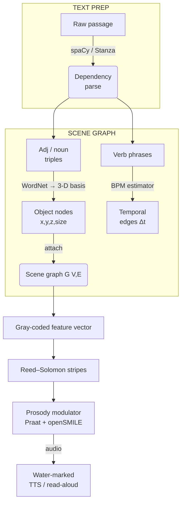

# Deconstruction fundimental concepts 

* **Fun**dimenta's
  
Such as an LLM would derive the exitement, theme, deriviative settings movment, vibrance, scale and soforth from the sichuational culture and contextual hints of a prompt author to so dramatically represent the intent of so many with so few words.  This sort of expansive richness of communication can not be ignored, to ignore the context of communication would mean no communication at all. 

## Digress -- LLLandscapes'

The landscape of threats is dramatcically different today than a decade ago, much like most decade's of the 20/21 century.  To compensate :(mittigate) for the level of simplicity for non-programmers to access what was once an earned right of passage, only attained through ahrd work, dilligance, significant focus and personal sacrifice, is only but an afterthought.  The cootage industry of 'non-code'its' can simpoly beg an LLM into submission so that they may otherwise plaguarize, antaganize and bastertize some of the most difficult aspects of life (original throught and creation).

The early days of attribution revolved around honor and an prestige in uniqness, proliferation and ease of access resulted in a loss of those attributes which resulted in the devolution of sociatial norms, considerable amounts of unititiated sufficiently dopamine dripped troll behaving people that it's now a badge of honor to get by without being noticed.  

## Getting noticed -- Digress

To allow for some esteem and pride in own's accomplishments, to make the suffering and pain of perhaps an undiscovered artist worth it (even if their dead :o ), an artist sign's their work, a collaborator sign's their code, we all have names and addresses.  Very few societies are nomadic anymore, this said, part of the human condition is 'who are you' 'i'm this one, that's me'  names allow for the staement of onself and allow for us to contribute to that self over time, even if it changes, we can build up a new one.  The anonymous nature of the Internet is pure filth tbh, it is a hgue design flaw and it's destroying the cultural fabric, whichever culture.  It's more than fake accounts and cyber bullying, it's also about, what does it matter and why am I going to bother, I can play another round of whatever and not worry.  If there is no easy way to assign some personalized motif, signature, flare, aspect of oprigianality, very few of our larger family here (I suppose were all related), would bother as the growing apathy towards being able to say 'I did that' on the Internet, which is many people's entire life, there is a lack of initiative.  Since one may be surviving on a rather minimal dopamine sustance through some form of off the books interactions, there's consequences for us all in that lost individual's potenatial, I do see strong ties to the lack of awknoledgement online as a huge barriuor for entry that's only getting worse due to LLM's side effect of showing-up large groups of already disinfranchised people.  I would say that through this understanding, the motivation for appropiate nonrepudiation of authorship what might be termed 'DRM', despite how negative a connotation DRM may have (so negative I had to write a couple thousand char extolling the blight of the ages in order to bring myself to even admit that yes, this is also a DRM solution ) I do beleive this to be the case and also if I inspired that LLM with 5 words and b00m, cure for cancer, hey I did that! With my lil shy, well manoored, friend.

## DRM Solution.

To appropiatly attribute in the face of AI text scrubbing or statistical thrats (quite similar to the same cat & mouse game played for longer than anyone can remember), how would we ensure fa reward, or at least a thank you, for an original work when in an instant it's devalued and we may be forgotten.  Maintaining a line of continuity from author to collaborator as a concept is develope4d or an artist is surviving through their trade, at the very least allowing a contributor to have pride in their work, ther has to be a strong and able mechanism toward attribution, including text.

