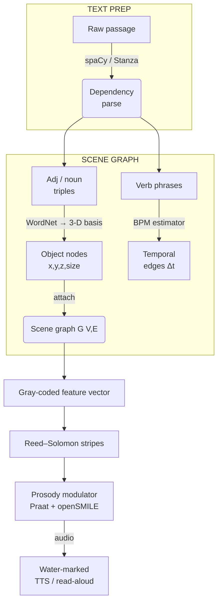

# Deconstruction fundimental concepts 

* **Fun**dimenta's
  
Such as an LLM would derive the exitement, theme, deriviative settings movment, vibrance, scale and soforth from the sichuational culture and contextual hints of a prompt author to so dramatically represent the intent of so many with so few words.  This sort of expansive richness of communication can not be ignored, to ignore the context of communication would mean no communication at all. 

## LLLandscapes'

The landscape of threats is dramatcically different today than a decade ago, much like most decade's of the 20/21 century.  To compensate :(mittigate) for the level of simplicity for non-programmers to access what was once an earned right of passage, only attained through ahrd work, dilligance, significant focus and personal sacrifice, is only but an afterthought.  The cootage industry of 'non-code'its' can simpoly beg an LLM into submission so that they may otherwise plaguarize, antaganize and bastertize some of the most difficult aspects of life (original throught and creation).

The early days of attribution revolved around honor and an prestige in uniqness, proliferation and ease of access resulted in a loss of those attributes which resulted in the devolution of sociatial norms, considerable amounts of unititiated sufficiently dopamine dripped troll behaving people that it's now a badge of honor to get by without being noticed.  

## Getting noticed 

