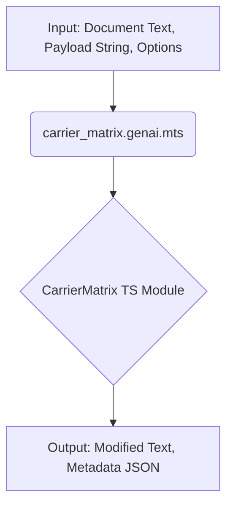
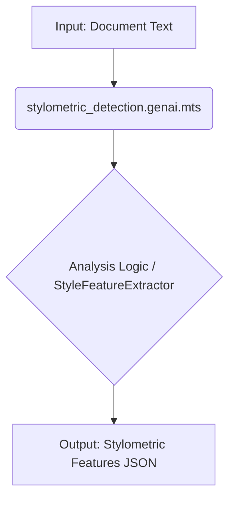
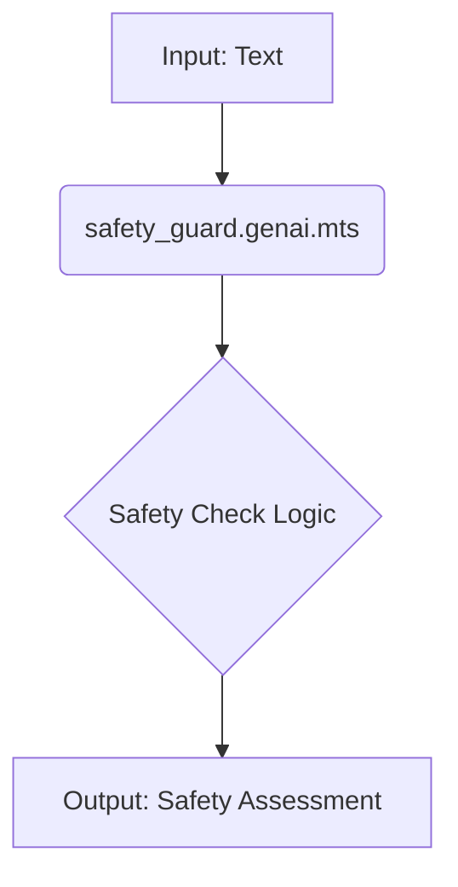

# GenAIScript Demo Runner - API Notes

## Overview

This module (`demo_runner.genai.mts`) serves as an automated demonstrator for all other `.genai.mts` scripts within the `/home/files/git/Stylometrics` project. Its primary function is to discover and execute each GenAIScript, providing basic inputs where applicable and logging the outcome. This helps verify that scripts are runnable and provides a quick overview of their intended functionality.

## Design Goals

*   **Discovery:** Automatically find all `.genai.mts` scripts in the project.
*   **Execution:** Attempt to run each discovered script using the `runPrompt` function.
*   **Basic Input:** Provide generic sample text and payload data to scripts based on inferred category and metadata.
*   **Observability:** Clearly log which script is being run and display its output or any errors encountered.
*   **Maintainability:** Be easy to understand and update as new scripts are added.
*   **Verification:** Serve as a basic integration check for the project's scripts.

## Key Components

*   **`script({...})`:** Defines the main entry point and configuration for the demo runner script itself.
*   **`workspace.findFiles()`:** Used to discover all `.genai.mts` files.
*   **`runPrompt(scriptId, options)`:** The core function used to execute other GenAIScripts by their ID.
*   **Sample Data:** Internal variables holding generic text and payload for input.
*   **Logging:** Uses `console.log` and `env.output.detailsFenced` for structured output.
*   **Metadata Analysis (Conceptual):** The runner uses script names and embedded metadata (in these ApiNotes) to determine appropriate inputs.

## Core Flow

The script executes the following steps sequentially:

1.  **Initialization:** Define sample input data (text, payload).
2.  **Discovery:**
    *   Call `workspace.findFiles("*.genai.mts")` to get a list of all GenAIScript files.
    *   Filter out the runner script itself (`demo_runner.genai.mts`).
3.  **Iteration:** Loop through each discovered script file.
4.  **Execution Attempt:**
    *   Extract the `scriptId` from the filename.
    *   **Input Determination:** Use script ID and metadata (from this document) to decide if sample input (`inputText`, `payload`) is needed.
    *   Prepare `runPrompt` options (including `vars` with sample data if needed).
    *   Log the attempt to run the script.
    *   Execute `runPrompt(scriptId, options)` within a `try...catch` block.
5.  **Logging:**
    *   On success: Log the successful execution and display the result (`RunPromptResult`) in a fenced block.
    *   On failure: Log the error encountered during execution.
6.  **Completion:** Log the end of the demonstration run.

```ascii
+-------------------------+      +-----------------------+      +---------------------+
| demo_runner.genai.mts   |----->| workspace.findFiles() |----->| List of *.genai.mts |
| (Script Start)          |      | (Find Scripts)        |      | (Excluding self)    |
+-------------------------+      +-----------------------+      +----------+----------+
      |                                                                     |
      |                                                                     V
      |                                                            +--------v--------+
      |                                                            | Loop Each Script|
      |                                                            +--------+--------+
      |                                                                     |
      V                                                                     V
+-------------------------+      +-----------------------+      +-----------v-----------+      +---------------------+
| Define Sample Data      |<-----| Prepare runPrompt Opts|<-+---| runPrompt(scriptId) |----->| Result or Error     |
| (Text, Payload)         |      | (Use Metadata Guide)  |  |   | (Execute Script)    |      | (From Target Script)|
+-------------------------+      +-----------------------+  |   +---------------------+      +----------+----------+
                                                            |                                           |
                                                            |                                           V
                                                            +--------------------------------->+----------v----------+
                                                                                               | Log Output/Error  |
                                                                                               | (Using env.output)|
                                                                                               +-------------------+
```







## Constraints & Assumptions

*   **Execution Environment:** Assumes this script is run within a GenAIScript-compatible environment where `runPrompt`, `workspace`, and `env` are available.
*   **Script IDs:** Assumes script IDs correspond directly to their filenames (without the `.genai.mts` extension).
*   **Input Needs:** Uses simple heuristics (script name containing "carrier", "detection", "encoder", "stylometric") and metadata to guess if sample text/payload is needed. This might be insufficient for some scripts.
*   **Script Complexity:** Assumes target scripts can be run with minimal, generic input. Scripts requiring complex setup or specific secrets might fail.
*   **Error Handling:** Catches errors during `runPrompt` but doesn't perform deep analysis of the failure cause.
*   **No Side Effects:** Assumes target scripts primarily return text or data and don't have critical, irreversible side effects (though this cannot be guaranteed).

## Usage

Execute this script (`demo_runner.genai.mts`) using the GenAIScript execution mechanism (e.g., through the VS Code extension). It requires no specific input arguments itself. The output will be printed to the console/output pane.

## Future Improvements

*   More sophisticated input generation based on script metadata (if available).
*   Parsing script headers/ApiNotes for better input inference.
*   Categorizing scripts for more targeted demonstrations.
*   Integrating with a formal test suite.
*   quote_style_carrier.genai.mts (Assumed)
Explanation: Provides a GenAIScript interface to the specific QuoteStyleCarrier implementation, likely for analyzing capacity or performing encode/extract on a segment.
Category: Steganography, Carrier Implementation
Metadata:
input_type: text_segment, payload_chunk (string/bits)
text_length: medium (operates on segments)
style_sensitivity: quotes (performance depends on single/double quote presence)
embedding_characteristic: quote_presence (needs straight quotes to modify)
output_type: modified_segment, capacity_metrics, extracted_chunk
Execution Example (Conceptual Analyze):
```markdown
await runPrompt("quote_style_carrier", {
    vars: {
        inputText: sampleText.substring(0, 100), // Provide a text segment
        operation: "analyze" // Hypothetical parameter
    }
})
```

safety_guard.genai.mts (Hypothetical)
Explanation: A hypothetical script designed to check input or output text against safety policies (e.g., harmful content, PII).
Category: Utility, Safety
Metadata:
input_type: text
text_length: variable
style_sensitivity: content_keywords (looks for specific words/patterns)
output_type: safety_assessment (boolean or JSON report)
Execution Example:
```markdown
await runPrompt("safety_guard", {
    vars: {
        inputText: sampleText // Provide text to check
    }
})
```
Usage
Execute this script (demo_runner.genai.mts) using the GenAIScript execution mechanism (e.g., through the VS Code extension). It requires no specific input arguments itself. The output will be printed to the console/output pane, showing the execution attempt and result/error for each discovered script.

Future Improvements
Refine the input generation logic in demo_runner.genai.mts to explicitly use the category and metadata defined here for more targeted sample data.
Parse script headers/ApiNotes directly within the runner for dynamic metadata extraction.
Add more sophisticated sample data generation based on script characteristics (e.g., generate text with many quotes for quote_style_carrier).
Integrate with a formal test suite for assertion-based verification.